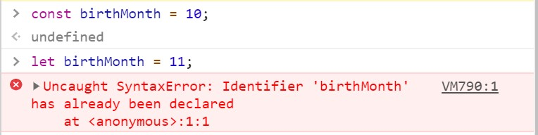

# Constant

In situation where we don't want the value of a variable to be changed, we can use `constant` instead of variable.

```javascript
const birthMonth = 10;
console.log(birthMonth);
```


We are not allowed to change the value of a constant. 


Let's try doing it and see what will happen.

If i were to change the `birthMonth` to 11,

```javascript
let birthMonth = 11;
```

I will get an error message on my console, 




[:arrow_backward: Previous Page : Basics of JavaScript : Constant :unlock:](basics-of-javascript/constant.md)  &nbsp;&nbsp;&nbsp;&nbsp;&nbsp;&nbsp;&nbsp;&nbsp;&nbsp;&nbsp;&nbsp;&nbsp;&nbsp;&nbsp;&nbsp;&nbsp;&nbsp;&nbsp;&nbsp;&nbsp;&nbsp;&nbsp;&nbsp;&nbsp;&nbsp;&nbsp;&nbsp;&nbsp;&nbsp;&nbsp;&nbsp;&nbsp;&nbsp;&nbsp;&nbsp;&nbsp;&nbsp;&nbsp;&nbsp;&nbsp;&nbsp;&nbsp;&nbsp;&nbsp;&nbsp;&nbsp;&nbsp;&nbsp;&nbsp;&nbsp;&nbsp;&nbsp;&nbsp;&nbsp;&nbsp;&nbsp;&nbsp;&nbsp;&nbsp;&nbsp;&nbsp;&nbsp;&nbsp;&nbsp;&nbsp;&nbsp;&nbsp;    [:arrow_forward: Next Page : Basics of JavaScript : Constant :unlock:](basics-of-javascript/constant.md)