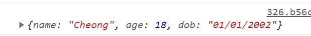
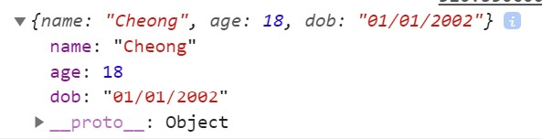

# :unlock:  Object

If I were to create variables called name, age, DOB, address of a person, i can just simply type:

```javascript
let name = 'Cheong';
let age = 18;
let dob = '01/01/2002';
```

However, if i were to create the this properties of 10 person and printing it one by one, this will be a lot of work. Hence, we can use **object** to store the properties and then key in the values.

### Creating an Object

Let's say I want to create an **object** named person, with properties as stated above. I just need to type:

```javascript
let person = {
    name: 'Cheong',
    age: 18,
    dob: '01/01/2002'
};
```

So if i want to take a look of what is stored in this person, i can just `console.log(person)`in the console. And I will see this:

<details><summary>Output</summary><br>

>   
<br><hr>

<details><summary>Upon Expanding</summary><br>   

>> <br><hr></details>
</details>
<br><br>
#### To print the properties of an object

We can use `for in` loop to print the properties of the **object**, in this case, `name`, `age` and `dob`.

```javascript
for (let properties in person ){
    console.log(properties); 
}
```

However, if i were to print both the properties and values of the object, i can use the code shown below:

```javascript
for (let properties in person ){
    console.log(properties,person.properties);
}
```

>   :warning:   **`person.properties`**`shows the value of the properties.`

<br><br><br>
<hr>

[:arrow_backward: Previous Page : Loops : For Loop :key: ](loops/for-loop.md)  &nbsp;&nbsp;&nbsp;&nbsp;&nbsp;&nbsp;&nbsp;&nbsp;&nbsp;&nbsp;&nbsp;&nbsp;&nbsp;&nbsp;&nbsp;&nbsp;&nbsp;&nbsp;&nbsp;&nbsp;&nbsp;&nbsp;&nbsp;&nbsp;&nbsp;&nbsp;&nbsp;&nbsp;&nbsp;&nbsp;&nbsp;&nbsp;&nbsp;&nbsp;&nbsp;&nbsp;&nbsp;&nbsp;&nbsp;&nbsp;&nbsp;&nbsp;&nbsp;&nbsp;[:house_with_garden:](../../README.md)&nbsp;&nbsp;&nbsp;&nbsp;&nbsp;&nbsp;&nbsp;&nbsp;&nbsp;&nbsp;&nbsp;&nbsp;&nbsp;&nbsp;&nbsp;&nbsp;&nbsp;&nbsp;&nbsp;&nbsp;&nbsp;&nbsp;&nbsp;&nbsp;&nbsp;&nbsp;&nbsp;&nbsp;&nbsp;&nbsp;&nbsp;&nbsp;&nbsp;&nbsp;&nbsp;&nbsp;&nbsp;&nbsp;&nbsp;&nbsp;&nbsp;&nbsp;&nbsp;&nbsp;    [:arrow_forward: Next Page : Control Flow : Array :triangular_flag_on_post: :unlock: ](array.md)