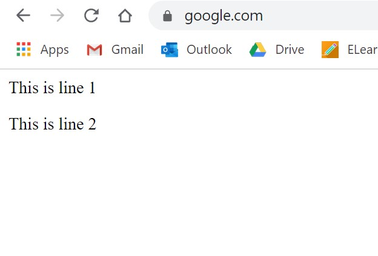
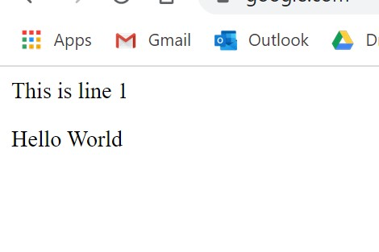
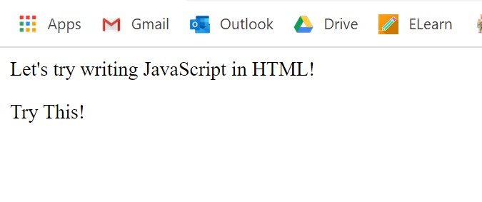
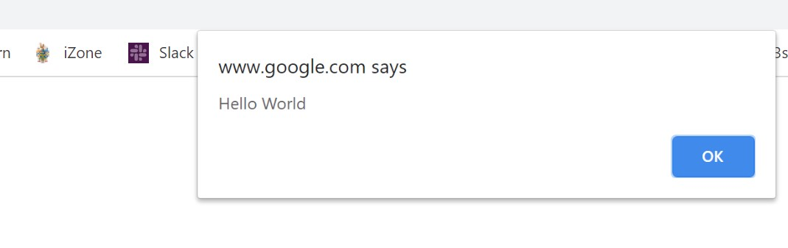
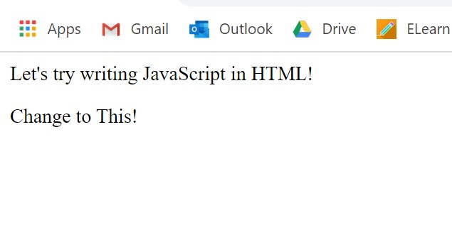

# :triangular_flag_on_post:How to write JavaScript in HTML

### :heavy_check_mark: How to write a message in JavaScript

Over here, we are going to teach you 3 methods to write a message in JavaScript.

* **alert\(\)**

```javascript
    alert('Hello World');
``` 
> This will be the output in your browser
>> 

<br>

* **document.write\(\)**

```javascript
document.write("Hello World");
```

> This will be the output in your browser
>> 

<br>

* **innerHTML**

    **`innerHTML`** has to be tagged along with the element that you want to change using a query selector.<br>

    > :information_source:  In this section, the query selector that you will learn is **`getElementById()`**


    If i were to modify the message in `<p>` with `id='change'`to "Hello World", I can choose the element by using `getElementById("change")`and assign it with the value I want.

<br>

```markup
<!DOCTYPE html>
<html>
    <head>
        <title>InnerHTML</title>
    </head>

    <body>
        <p>This is line 1</p>
        <p id='change'>This is line 2</p>

        <script>
            document.getElementById('change').innerHTML = 'Hello World';
        </script>

    </body>
</html>
```
<br>

> Before adding <script>
>> 

<br>

> After adding <script>
>> 

<br>

### :heavy_check_mark: To write JavaScript in a HTML file

We need to include **`<script>   </script>`** in the **`<body>`** of the HTML element.

```markup
<!DOCTYPE html>
<html>
    <head>
        <title>This is the HTML Page</title>
    </head>

    <body>
        <p>Let's try writing JavaScript in HTML!</p>
        <p id='this'>Try This!</p>

        <script>
            alert('Hello World');
            document.write('I love WebLaunch');
            document.getElementById('this').innerHTML='Change to This!';
            
        </script>

    </body>
</html>
```

These are the outputs:

> alert\(\'Hello World\'\);
>> 

> document.write\(\'I love WebLaunch\'\);
>> 

> document.getElementById\(\'this\'\).innerHTML=\'Change to This!\';
>> 
