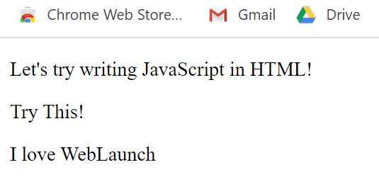
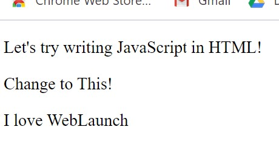

# :triangular_flag_on_post:How to write JavaScript in HTML

### :heavy_check_mark: <ins>How to write a message in JavaScript</ins>

Over here, we are going to teach you 3 methods to write a message in JavaScript.

<details><summary> **alert\(\)** </summary>
<br>

```javascript
    alert('Hello World');
``` 
> This will be the output in your browser
>> 
</details>

<br>

<details><summary> **document.write\(\)** </summary>
<br>

```javascript
    document.write("Hello World");
```

> This will be the output in your browser
>> 
</details>

<br>

<details><summary> **innerHTML** </summary>
<br>

**`innerHTML`** has to be tagged along with the element that you want to change using a query selector.

<br>

> :information_source:  In this section, the query selector that you will learn is **`getElementById()`**
<br>

If i were to modify the message in `<p>` with `id='change'`to "Hello World", I can choose the element by using `getElementById("change")`and assign it with the value I want.

<br>

```HTML
    <!DOCTYPE html>
    <html>
        <head>
            <title>InnerHTML</title>
        </head>

        <body>
            <p>This is line 1</p>
            <p id='change'>This is line 2</p>

            <script>
                document.getElementById('change').innerHTML = 'Hello World';
            </script>

        </body>
    </html>
```
<br>

<!-- | <ins>Before adding <script></ins> | <ins>After adding <script></ins> |
|---|---|
|  |  | -->

<details><summary><ins>Before adding <script></ins></summary>
<br> 


</details>
<details><summary><ins>After adding <script></ins></summary>
<br>

 |
</details>

</details>

### :heavy_check_mark: <ins>To write JavaScript in a HTML file</ins>

We need to include **`<script>   </script>`** in the **`<body>`** of the HTML element.

```HTML
<!DOCTYPE html>
<html>
    <head>
        <title>This is the HTML Page</title>
    </head>

    <body>
        <p>Let's try writing JavaScript in HTML!</p>
        <p id='this'>Try This!</p>

        <script>
            alert('Hello World');
            document.write('I love WebLaunch');
            document.getElementById('this').innerHTML='Change to This!';
            
        </script>

    </body>
</html>
```

<!-- > These are the outputs:<br>

| alert\(\'Hello World\'\); | document.write\(\'I love WebLaunch\'\); | document.getElementById\(\'this\'\).innerHTML=\'Change to This!\'; |
|---|---|--|
|  |  |  | -->


>These are the outputs:<br>

<details><summary> alert\(\'Hello World\'\); </summary><br>

 
</details>

<details><summary> document.write\(\'I love WebLaunch\'\); </summary><br>

 
<details>

<details><summary> document.getElementById\(\'this\'\).innerHTML=\'Change to This!\'; </summary><br>

 |
<details>


<br><br><br>
<hr>

[:arrow_backward: Previous Page : JavaScript :triangular_flag_on_post:](javascript.md)  &nbsp;&nbsp;&nbsp;&nbsp;&nbsp;&nbsp;&nbsp;&nbsp;&nbsp;&nbsp;&nbsp;&nbsp;&nbsp;&nbsp;&nbsp;&nbsp;&nbsp;&nbsp;&nbsp;&nbsp;&nbsp;&nbsp;&nbsp;&nbsp;&nbsp;&nbsp;&nbsp;&nbsp;&nbsp;&nbsp;&nbsp;&nbsp;&nbsp;&nbsp;&nbsp;&nbsp;&nbsp;&nbsp;&nbsp;&nbsp;&nbsp;&nbsp;&nbsp;&nbsp;&nbsp;&nbsp;[:house_with_garden:](README.md)&nbsp;&nbsp;&nbsp;&nbsp;&nbsp;&nbsp;&nbsp;&nbsp;&nbsp;&nbsp;&nbsp;&nbsp;&nbsp;&nbsp;&nbsp;&nbsp;&nbsp;&nbsp;&nbsp;&nbsp;&nbsp;&nbsp;&nbsp;&nbsp;&nbsp;&nbsp;&nbsp;&nbsp;&nbsp;&nbsp;&nbsp;&nbsp;&nbsp;&nbsp;&nbsp;&nbsp;&nbsp;&nbsp;&nbsp;&nbsp;&nbsp;&nbsp;&nbsp;&nbsp;&nbsp;&nbsp;    [:arrow_forward: Next Page : Basics of JavaScript : Variables :unlock:](basics-of-javascript/variables.md)

